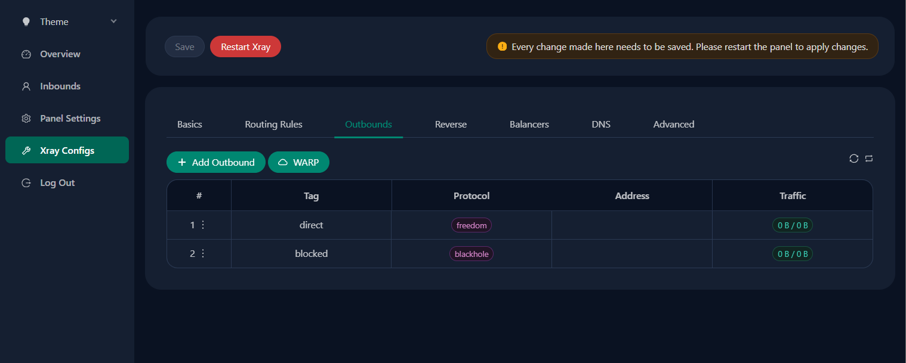
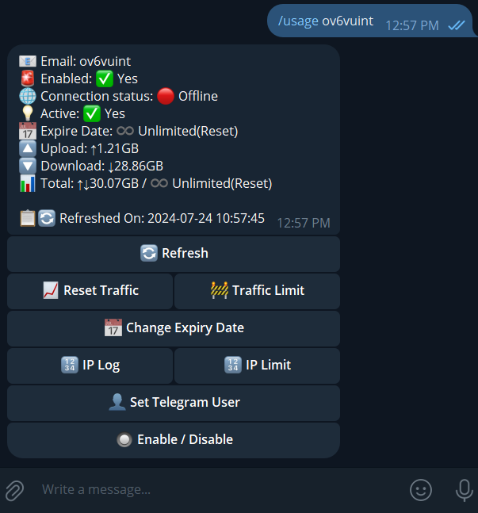

# 3xui. IAC

[](https://github.com/fisher772/3xui/releases)
[](https://github.com/fisher772/3xui)
[](https://github.com/fisher772/nginx-le)
[](https://github.com/fisher772/docker_images)
[](https://github.com/fisher772/ansible)
[](https://github.com/fisher772/3xui/pkgs/container/3xui)
[](https://hub.docker.com/r/fisher772/3xui)

## All links, pointers and hints are reflected in the overview

\* You can use Ansible templates and ready-made CI/CD patterns for Jenkins and GitHub Action. 
Almost every repository contains pipeline patternsю Also integrated into the Ansible agent pipeline using its templates.


[3xui source](https://github.com/MHSanaei/3x-ui)

\* Pre-select and install a client to establish a connection to the VPN. It will also act as a kind of Middle Service

Client APP:
- Hiddify
- V2Box
- v2RayTun
\* For smart tv devices. Fork of enthusiasts on Hdiffy for easy connection with tv devices
- [VPN4TV](https://vpn4tv.com/quick-guide.html)

3xui is an advanced web panel for Xray that supports multi-protocol and multi-user settings. It allows you to manage traffic, limit IP addresses, and save expiration for various protocols such as VMess, VLESS, Trojan, ShadowSocks, and WireGuard.

Why do I need a 3xui?
- VPN with custom, security-leading protocols and analytics in one box
- Xray panel supporting multi-protocol multi-user expire day & traffic & ip limit (Vmess & Vless & Trojan & ShadowSocks & Wireguard)
- Free and Open-Source

My small fork example generates a configuration file for a reverse proxy balancing nginx which also regulates service availability at the level of service access rules. You can distribute external access to the service or restrict access. Provide access only to off-network users from VPN traffic or external IP addresses specified by you.

I made some minor changes to the source code of the application to automate deployment and eliminate unnecessary manual settings. I also slightly rewrote the source code for the Sec and Ops practices.

Changes:
3x-ui/config/config.go
3x-ui/config/config.go
3x-ui/web/service/config.json
3x-ui/web/service/setting.go
3x-ui/database/db.go
3x-ui/web/service/setting.go

- Changed the default login and password of the web panel to generate arbitrary and more complex ones, which can be extracted from a flat file in the /etc/x-ui/board_creds directory container 3xui
- Changed the standard ports
- Changed the context path to "/board"
- Changed the default session timeout in the web panel to "15 minutes"
- Changed the standard trigger for bot alerts on CPU performance
- Enabled availability logging
- Integrated fail2ban

All you need to do to install 3xui:
- My installed nginx-le image
- Specify your network parameters in docker manifest
- Docker manifest. Open external and internal port pool for VPN clients (Backend)
- Change the env_example file to .env and set the variable values ​​in the .env file.
- Have free resources on the host/hosts
- Deploy docker compose manifest
- Move configuration files from the mounted volume 3xui_nginx_conf to the volume with the nginx configuration files of the nginx container:
  service* file to conf.d-le directory
  stream* file to stream.d-le directory
- Reboot Nginx container for apply configs
- Follow the instructions from the official 3xui source for personalized service settings


Environment:

|  Environment                | Default value         | Customize (env variable)\*\*             |
| --------------------------- | --------------------- | ---------------------------------------- |
| TZ                          | Asia/Yekaterinburg    | -                                      |
| LE_FQDN                     | -, Domain address     | FQDN                                     |
| CONTAINER_ALIAS             | -, Zone Name          | C_ALIAS                                  |
| SERVER_ALIAS                | -, Container address  | S_ALIAS                                  |


Commands:

```bash
sudo sleep 30 && sudo cp /var/lib/docker/volumes/*nginx_conf/_data/conf/service-*.conf /var/lib/docker/volumes/nginx_data/_data/conf.d-le && \
sudo sleep 30 && sudo cp /var/lib/docker/volumes/*nginx_conf/_data/stream/stream-*.conf /var/lib/docker/volumes/nginx_data/_data/stream.d-le && \
docker restart nginx && \
sudo sleep 30 && docker exec -it nginx nginx -t
```

## Preview

\* More info: 3xui/media/*




