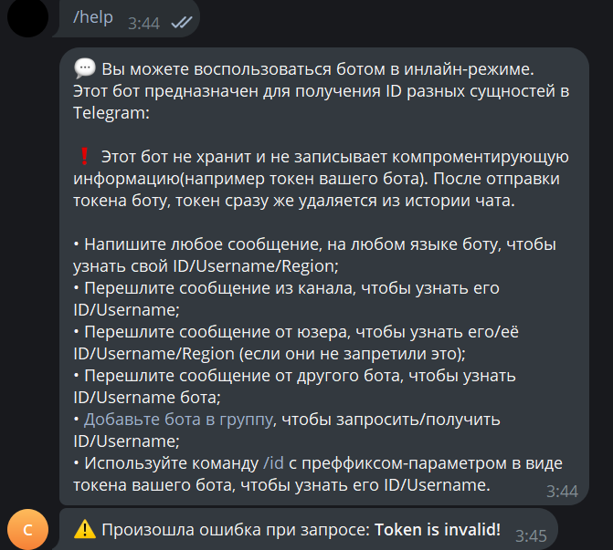
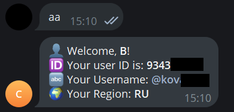
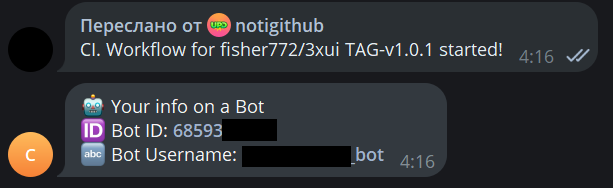

# Check Telegramm Info Bot. IAC

The bot is designed to automate the extraction of information about an entity and eliminate manual extraction of the same information, even if these are rare Ad-hoc requests. Moreover, there is no trust in open community bots with the same functionality, since it can store all the information that you pass through it. For example: region, name, nickname, unique identifier and type of this entity. Lightweight, flexible and safe, since the bot does not store information about the tokens that you can send it, in addition, it immediately deletes it from the chat history to prevent leakage. The bot can work through a proxy (Skivd is just useful). All configuration is carried out within the environment variables and the docker manifest.

Environment:

A more detailed explanation of the variables can be found in the git repository: check_id_bot/env_example

## Preview

